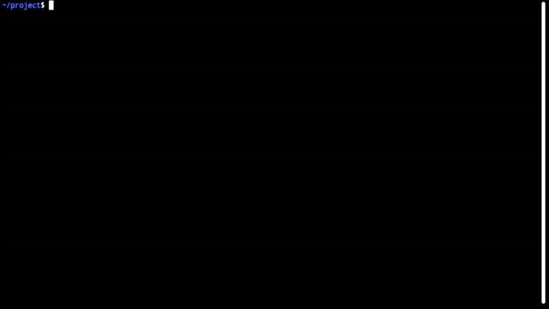
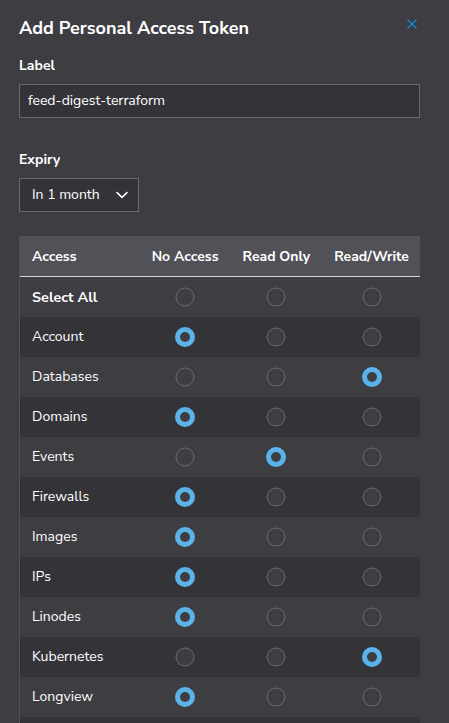
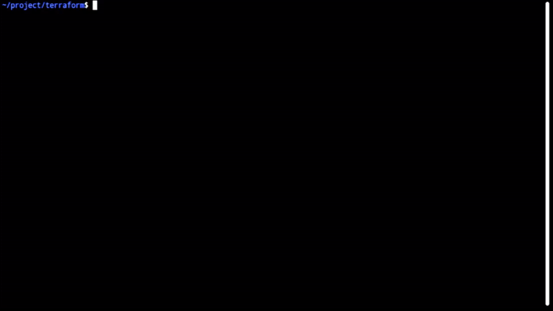
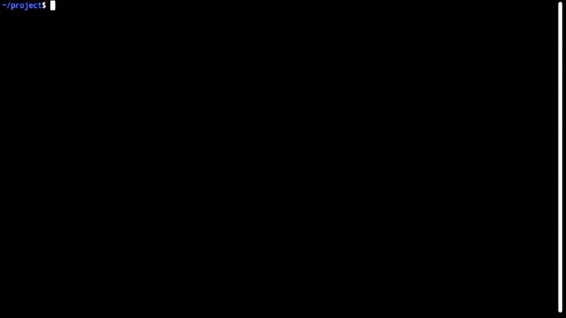
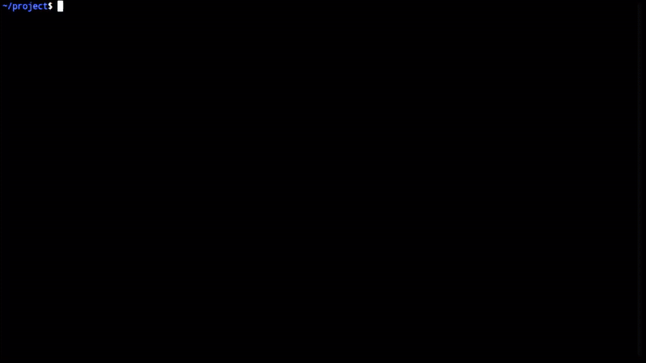

# Feed Digest

A personalized newsletter system that delivers AI-curated content briefings on demand, powered by [Akamai LKE](https://www.linode.com/products/kubernetes/) with [KServe](https://kserve.github.io/website/latest/) scale-to-zero GPU management. Users select a timeframe and receive a synthesized briefing of the most relevant articles — the GPU only runs during active processing.

## Architecture

```
+----------------------------------------------------------------------+
|                        User's Browser                                |
|      +----------------------------------------------------------+    |
|      |  Frontend (HTML/CSS/JS) - Timeframe select & briefing    |    |
|      +----------------------------+-----------------------------+    |
+-----------------------------------+----------------------------------+
                                    | HTTP
                                    v
+----------------------------------------------------------------------+
|                  LKE Cluster (feed-digest namespace)                 |
|                                                                      |
|  +----------------------------------------------------------------+  |
|  |  app-service (LoadBalancer -> NodeBalancer)                    |  |
|  |  +-----------------------------------------------------------+ |  |
|  |  |  FastAPI App Deployment (CPU node pool)                   | |  |
|  |  |  - Serves web UI                                          | |  |
|  |  |  - Creates digest jobs                                    | |  |
|  |  |  - Returns job status & completed briefings               | |  |
|  |  +-----------------------------------------------------------+ |  |
|  +----------------------------------------------------------------+  |
|                                                                      |
|  +---------------------------+    +-------------------------------+  |
|  |  Worker Deployment (CPU)  |    |  Crawler CronJob (CPU)        |  |
|  |  - Polls for queued jobs  |    |  - Runs hourly                |  |
|  |  - Calls vLLM API for     |    |  - Fetches RSS, HN            |  |
|  |    scoring and briefing   |    |  - Extracts article content   |  |
|  |    writing (direct calls) |    |  - Stores in PostgreSQL       |  |
|  +------------+--------------+    +-------------------------------+  |
|               |                                                      |
|  +------------v---------------------------------------------------+  |
|  |  vLLM InferenceService (KServe, GPU node pool)                 |  |
|  |  - NVIDIA-Nemotron-Nano-9B-v2-FP8                              |  |
|  |  - Scale-to-zero (minReplicas: 0, 5m retention)                |  |
|  |  - 1x RTX 4000 Ada (20GB VRAM)                                 |  |
|  +----------------------------------------------------------------+  |
+----------------------------------------------------------------------+
                |
        +-------v---------------+
        |  Linode Managed       |
        |  PostgreSQL           |
        |  - Articles, scores   |
        |  - Jobs, digests      |
        |  - User profiles      |
        +-----------------------+
```

## How It Works

1. The **crawler** runs hourly as a Kubernetes CronJob, fetching articles from RSS feeds and [Hacker News](https://news.ycombinator.com), extracting article content with [trafilatura](https://trafilatura.readthedocs.io/), and storing them in PostgreSQL with their publication timestamp
2. Users visit the web UI, select their **interests** (topics like Software Engineering, AI/ML, DevOps), and choose a **timeframe** (1 day, 3 days, or 7 days). The timeframe filters articles by publication timestamp; the interests guide scoring and briefing generation
3. A **job** is created (storing the selected interests) and picked up by the **worker**
4. The worker triggers [vLLM](https://docs.vllm.ai/) scale-up via KServe if the GPU pod has scaled to zero. While waiting, the UI polls the Kubernetes API and displays **live pod status** — phase, container state, and recent pod events — so users can see exactly what's happening during cold start
5. The worker calls the vLLM API to **score** each article's relevance to the user's selected interests on a scale of 1-10 (one call per batch of 20)
6. The worker calls the vLLM API to **write a briefing** in HTML from the top-scored articles, connecting themes and citing sources
7. The GPU pod scales back to zero after 5 minutes of inactivity

> [!NOTE]
> KServe scale-to-zero only manages the **pod** — it unloads the model and frees GPU memory, but the underlying GPU node stays running. LKE requires a minimum of 1 node per pool, so the GPU VM is always active, regardless of utilization. For this demonstration, the always-on node means faster cold starts (only the pod needs to schedule and load the model, not the entire VM).

## Model

This project uses [nvidia/NVIDIA-Nemotron-Nano-9B-v2-FP8](https://huggingface.co/nvidia/NVIDIA-Nemotron-Nano-9B-v2-FP8), an open model under the NVIDIA Open Model License. No HuggingFace token is required — the model downloads automatically when the vLLM pod starts.

## Project Structure

```
project/
├── terraform/                          # Infrastructure as Code
│   ├── main.tf                         #   LKE cluster + managed PostgreSQL
│   ├── variables.tf                    #   Variable definitions
│   ├── outputs.tf                      #   Kubeconfig, DB URL, and cluster outputs
│   └── terraform.tfvars.example        #   Example variables
├── k8s/                                # Kubernetes manifests (numbered for apply order)
│   ├── 00-namespace.yaml               #   feed-digest namespace
│   ├── 01-nvidia-device-plugin.yaml    #   NVIDIA GPU device plugin DaemonSet
│   ├── 02-secrets.yaml                 #   Database URL secret (envsubst)
│   ├── 03-rbac.yaml                    #   ServiceAccount + Role (pod/event read access)
│   ├── 04-vllm-inferenceservice.yaml   #   KServe InferenceService (scale-to-zero)
│   ├── 05-app-deployment.yaml          #   FastAPI app deployment (CPU)
│   ├── 06-app-service.yaml             #   App LoadBalancer service
│   ├── 07-worker-deployment.yaml       #   Worker deployment (CPU)
│   ├── 08-crawler-cronjob.yaml         #   Crawler CronJob (hourly)
│   ├── 09-db-init-job.yaml             #   One-time database schema init job
│   ├── deploy.sh                       #   Deploy script (envsubst + kubectl apply)
│   └── install-kserve.sh               #   One-time KServe installation script
├── app/                                # FastAPI web application
│   ├── __init__.py                     #   Package init + log suppression
│   ├── main.py                         #   FastAPI endpoints
│   ├── models.py                       #   Pydantic request/response models
│   ├── db.py                           #   asyncpg connection pool + queries
│   ├── config.py                       #   Environment variable config
│   ├── k8s_status.py                   #   Kubernetes pod/event status helper
│   └── schema.sql                      #   PostgreSQL schema (5 tables)
├── worker/                             # Background job processor
│   ├── __init__.py                     #   Package init
│   ├── main.py                         #   Job polling loop + orchestration
│   └── llm.py                          #   Direct vLLM API calls (scoring + briefing)
├── crawler/                            # Content fetcher (runs as CronJob)
│   ├── __init__.py                     #   Package init
│   ├── main.py                         #   CronJob entry point
│   ├── feeds.py                        #   RSS and HN fetchers (see RSS_FEEDS for the full feed list)
│   └── extractor.py                    #   trafilatura article extraction
├── static/                             # Frontend (vanilla HTML/CSS/JS)
│   ├── index.html                      #   Interest checkboxes, timeframe cards, progress + result views
│   ├── styles.css                      #   Dark theme styling
│   └── app.js                          #   Interest selection, job polling, live pod status display
├── Dockerfile                          #   Single image for app/worker/crawler
├── requirements.txt                    #   Python dependencies
└── README.md
```

## Prerequisites

- [Terraform](https://www.terraform.io/) >= 1.0
- [Docker](https://www.docker.com/) (for building container images)
- [kubectl](https://kubernetes.io/docs/tasks/tools/)
- [Akamai Cloud (Linode)](https://www.linode.com/) account with API token
- [Docker Hub](https://hub.docker.com/) account (for pushing images)

## Deployment

### Step 1: Build and push the container image

A single Docker image is used for all three components (app, worker, crawler). The Kubernetes manifests override the command for each.

#### Authenticate with Docker Hub

```bash
export DOCKERHUB_USER=your-dockerhub-username
docker login
```



([Go to high-resolution screencast](./screencasts/01-docker-login.mp4))

#### Build and push the image

```bash
docker build -t $DOCKERHUB_USER/feed-digest:latest .
docker push $DOCKERHUB_USER/feed-digest:latest
```


([Go to high-resolution screencast](./screencasts/02-docker-build-and-push.mp4))

> [!NOTE]
> Your Docker Hub repository must be **public** so that Kubernetes can pull the image without authentication. For production deployments, use a private repository with an `imagePullSecret`.

### Step 2: Create an Akamai Cloud personal access token

[Create an Akamai Cloud personal access token](https://techdocs.akamai.com/cloud-computing/docs/manage-personal-access-tokens) (Linode API token) for Terraform to use in provisioning resources. The token should have:

* **Read Only** permissions for **Events**
* **Read/Write** permissions for **Kubernetes**
* **Read/Write** permissions for **Databases**




([Go to high-resolution screencast](./screencasts/XX.mp4))

### Step 3: Create the LKE cluster and managed PostgreSQL

Navigate to the terraform directory and create a local copy of the variables file:

```bash
cd terraform
cp terraform.tfvars.example terraform.tfvars
```

Edit `terraform.tfvars` with your Linode API token:

```hcl
linode_token = "your-linode-api-token"
```


([Go to high-resolution screencast](./screencasts/04-tfvars.mp4))

Deploy the cluster and database:

```bash
terraform init
terraform plan
terraform apply
```


([Go to high-resolution screencast](./screencasts/05-terraform-apply.mp4))

This creates:
- **LKE cluster** with 2 node pools:
  - **CPU pool**: 3x `g6-standard-4` (4 CPU, 8GB RAM each) — hosts the app, worker, crawler, and KServe control plane
  - **GPU pool**: 1x `g2-gpu-rtx4000a1-m` (1x RTX 4000 Ada, 20GB VRAM) — hosts the vLLM inference pod
- **Managed PostgreSQL**: Single-node, encrypted database for articles, scores, jobs, and digests

### Step 4: Configure kubectl and verify cluster readiness

```bash
terraform output -raw kubeconfig | base64 -d > kubeconfig.yaml
export KUBECONFIG=$(pwd)/kubeconfig.yaml
kubectl get nodes
```

You should see 4 nodes (3 CPU + 1 GPU) in `Ready` status.



([Go to high-resolution screencast](./screencasts/06-configure-kubectl.mp4))

### Step 5: Install KServe (one-time)

The `install-kserve.sh` script installs [cert-manager](https://cert-manager.io/), [Knative Serving](https://knative.dev/docs/serving/), [Kourier](https://github.com/knative/net-kourier) (networking layer), and KServe. This only needs to run once per cluster.

```bash
./k8s/install-kserve.sh
```


([Go to high-resolution screencast](./screencasts/07-install-kserver.mp4))

Verify the installation:

```bash
kubectl get pods -n kserve
kubectl get pods -n knative-serving
kubectl get pods -n kourier-system
```

All pods should be `Running` or `Completed`.


([Go to high-resolution screencast](./screencasts/08-verify-get-pods.mp4))

### Step 6: Deploy to Kubernetes

The `k8s/deploy.sh` script uses `envsubst` to substitute `${DOCKERHUB_USER}` and `${DATABASE_URL}` into the manifests at apply time — no secrets are stored in the YAML files. The manifests are numbered to ensure they are applied in the correct order. The [NVIDIA device plugin](https://github.com/NVIDIA/k8s-device-plugin) DaemonSet enables Kubernetes to discover and schedule GPU resources on LKE GPU nodes.

Set the required environment variables:

```bash
export DATABASE_URL=$(cd terraform && terraform output -raw database_url)
```

The `DOCKERHUB_USER` and `KUBECONFIG` variables should already be set from earlier steps. Deploy:

```bash
./k8s/deploy.sh
```


([Go to high-resolution screencast](./screencasts/09-deploy-to-k8s.mp4))

#### Monitor the rollout

```bash
# Watch all pods come up
kubectl get pods -n feed-digest -w
```


([Go to high-resolution screencast](./screencasts/10-monitor-rollout.mp4))

The vLLM pod will initially show `0/1` replicas — this is expected because KServe scale-to-zero starts with no pods. The pod will spin up on the first digest request.

### Step 7: Initialize the database

The deploy step creates a one-time Job that runs the schema initialization. Verify it completed:

```bash
kubectl logs job/db-init -n feed-digest
```

You should see: `Database schema initialized successfully`


([Go to high-resolution screencast](./screencasts/11-database-init.mp4))

### Step 8: Seed the database with articles

The crawler CronJob runs hourly, but you can trigger it manually to populate the database immediately:

```bash
kubectl create job --from=cronjob/feed-crawler initial-crawl -n feed-digest
```

Monitor the crawl:

```bash
kubectl logs -f job/initial-crawl -n feed-digest
```

You should see output like `Total feed items: 500`. The first crawl pulls several hundred articles across all feeds; subsequent runs will skip most of them as duplicates.


([Go to high-resolution screencast](./screencasts/12-initial-crawl.mp4))

### Step 9: Access the application

Get the external IP assigned by the LoadBalancer (Linode NodeBalancer):

```bash
kubectl get svc app-service -n feed-digest
```

Wait for the `EXTERNAL-IP` to change from `<pending>` to an IP address, then open `http://<EXTERNAL-IP>` in your browser.


([Go to high-resolution screencast](./screencasts/13-get-external-ip.mp4))

#### Health check

> [!TIP]
> The [jq](https://jqlang.org/download/) tool supports all platforms, and provides prettier structured JSON outputs.

```bash
curl http://<EXTERNAL-IP>/health | jq
```

You should see `{"status": "healthy"}`.


([Go to high-resolution screencast](./screencasts/14-curl-service-health.mp4))

## Testing

### Verify article counts

After the initial crawl completes, check that the app is returning article counts:

```bash
curl http://<EXTERNAL-IP>/api/counts | jq
```

You should see counts for the 1-day, 3-day, and 7-day timeframes (listed in equivalent hours).



([Go to high-resolution screencast](./screencasts/15-verify-counts.mp4))

### Test vLLM scale-to-zero

Verify the vLLM pod is scaled to zero (no pods running):

```bash
kubectl get pods -n feed-digest -l serving.kserve.io/inferenceservice=vllm-nemotron
```

You should see no pod resources for the namespace.


([Go to high-resolution screencast](./screencasts/16-verify-no-gpu-pods.mp4))

### Test end-to-end digest generation

Open the app in your browser, select interests (or leave the defaults), and click a timeframe card (e.g., 1 day). Watch the status updates:

1. **"Scaling GPU..."** — KServe is spinning up the vLLM pod. A live pod status panel shows the pod phase, container state, and recent Kubernetes events as they come in
2. **"Scoring articles..."** — The worker is scoring relevance via direct vLLM API calls
3. **"Writing briefing..."** — The worker is generating the newsletter via vLLM
4. **"Done!"** — The briefing is displayed, with metadata showing which interests were used, the timeframe, how many articles were scored, and total processing time


([Go to high-resolution screencast](./screencasts/17-show-in-web.mp4))

> [!NOTE]
> The first digest request triggers a cold start: the vLLM pod needs to start and load the model into GPU memory. This can take several minutes. Subsequent requests within the 5-minute retention window will be much faster.

### Verify scale up of vLLM

While the web request runs, verify that KServe spins up the vLLM pod.

```bash
kubectl get pods -n feed-digest -l serving.kserve.io/inferenceservice=vllm-nemotron -w
```


([Go to high-resolution screencast](./screencasts/18-watch-pod-spinup.mp4))

After 5 minutes with no requests, scale-to-zero will terminate the vLLM pod. Another request to `get pods` will show no pod resources for the namespace.

### Monitor worker logs

To see the vLLM API calls in real-time during a digest job:

```bash
kubectl logs -f deployment/worker -n feed-digest
```

This shows the scoring and briefing calls to vLLM, including batch progress and output parsing.

## Troubleshooting

### Pods stuck in Pending

GPU pods may stay `Pending` if the GPU node is not ready or the NVIDIA device plugin hasn't registered:

```bash
kubectl describe pod -n feed-digest -l serving.kserve.io/inferenceservice=vllm-nemotron
kubectl get nodes
kubectl describe node <gpu-node-name> | grep -A 5 "Allocatable"
```

### vLLM pod keeps restarting

Check the vLLM pod logs for errors (e.g., out-of-memory):

```bash
kubectl logs -n feed-digest -l serving.kserve.io/inferenceservice=vllm-nemotron --previous
```

### Worker not picking up jobs

Check the worker logs:

```bash
kubectl logs deployment/worker -n feed-digest
```

Verify the DATABASE_URL is correct:

```bash
kubectl get secret feed-digest-secrets -n feed-digest -o jsonpath='{.data.DATABASE_URL}' | base64 -d
```

### Database connection errors

Verify the managed PostgreSQL is running in the Akamai Cloud Manager. Check that the [LKE cluster can reach the database](https://techdocs.akamai.com/cloud-computing/docs/aiven-manage-database#lke-and-database-clusters-connectivity).

### LoadBalancer stuck on Pending

If `app-service` never gets an external IP:

```bash
kubectl describe svc app-service -n feed-digest
```

This typically resolves within a few minutes as the Linode NodeBalancer provisions.

### Restarting deployments

```bash
kubectl rollout restart deployment/app -n feed-digest
kubectl rollout restart deployment/worker -n feed-digest
```

## Cleanup

To tear down everything:

```bash
# Delete Kubernetes resources
kubectl delete namespace feed-digest

# Destroy the LKE cluster and managed database
cd terraform
terraform destroy
```



([Go to high-resolution screencast](./screencasts/19-destroy.mp4))

> [!WARNING]
> This will delete the LKE cluster, the managed PostgreSQL database, and all data. Make sure you've saved anything important first.
